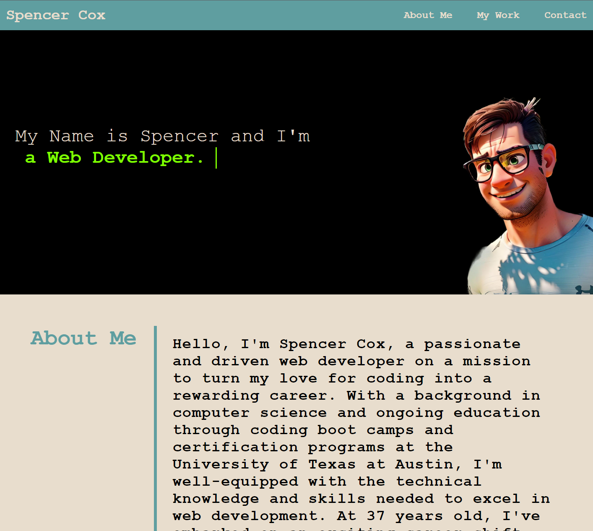
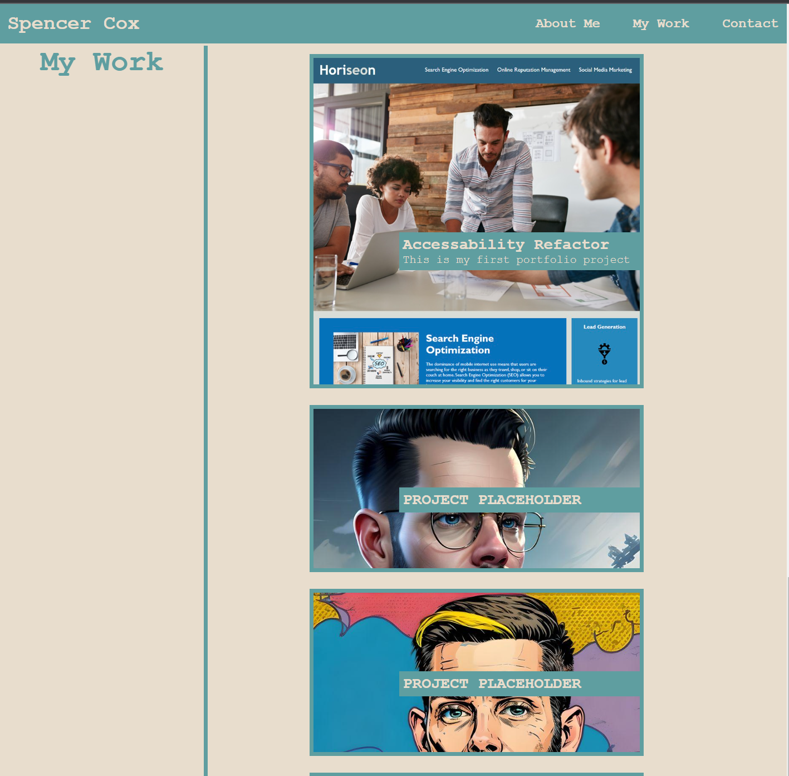

# Module_2_Portfolio

## Description

A single page webpage to show case my professional developer portfolio and key information about myself. 

My motivation for this project is to have an attractive and well designed place to put my work portfolio projects. This will become the platform that I can share with future potential employers and friends to showcase my work. It allows a single place where I can link to my portfolio web development projects. I learned that CSS is almost unlisted in it's capabilities and you can really be creative. Flexboxes are an invaluable tool in the construction and mobility of the project. 

## Usage

Navigation of the site is simple and straightforward:

Clicking the Name "Spencer Cox" on nav bar will scroll to the home position shown below.
Clicking the links to the left on the nav bar "About Me, My Work, Contact" will auto scroll the page to the top of the section.

The dynamic typing effect was a fun mini-project to work on and I have credited the youtube creator for the tutorial. 

If you choose the "My Work" link in the nav bar you will be taken to the portfolio projects section. You can hover over the pictures of the screenshots of the project and click the link to open the project in a new tab. My only completed portfolio project is at the top of the section can be clicked to link directly to the site. I have included 6 placeholders for future projects to help the page scroll better.

## Credits

1. Coding Boot Camp. (n.d.). Professional Readme Guide. GitHub. https://coding-boot-camp.github.io/full-stack/github/professional-readme-guide

2. CodingNepal. (2024, February 24). CSS Text Typing Animation | Multiple Text Typing Animation. YouTube. https://www.youtube.com/watch?v=m0o0QNpY9-0

